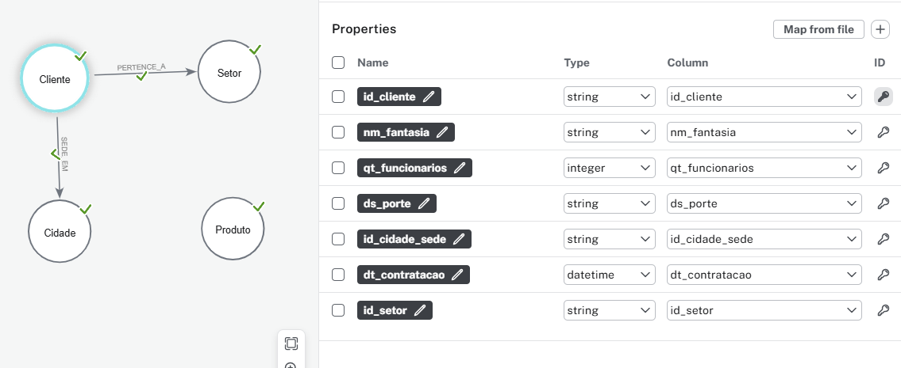
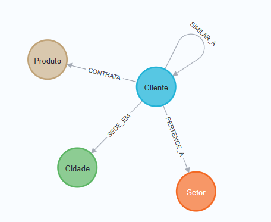
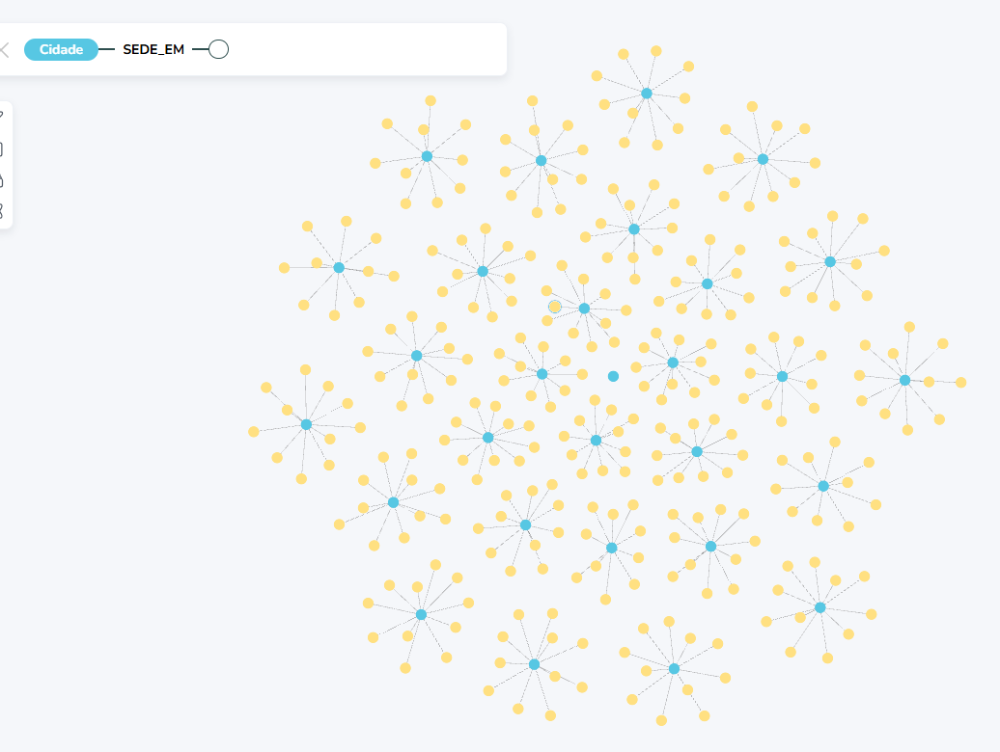
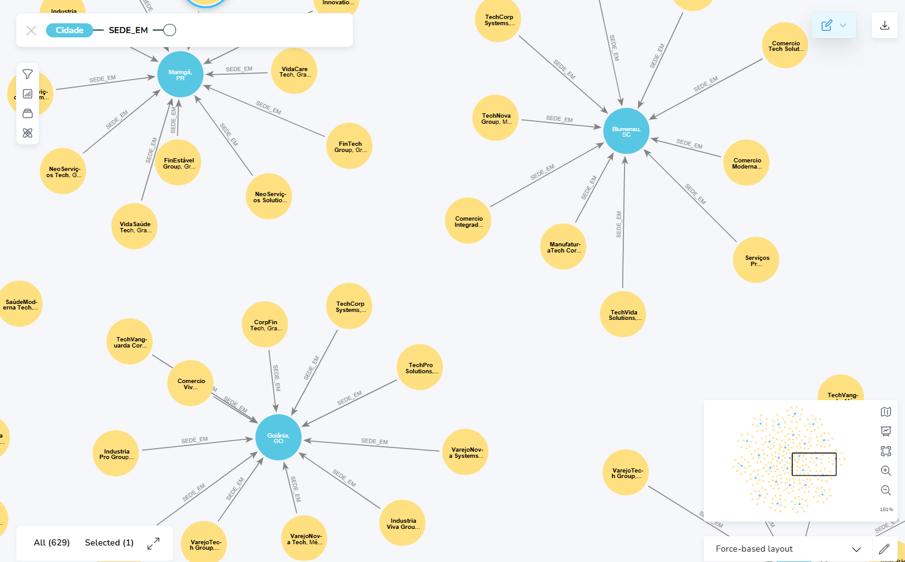
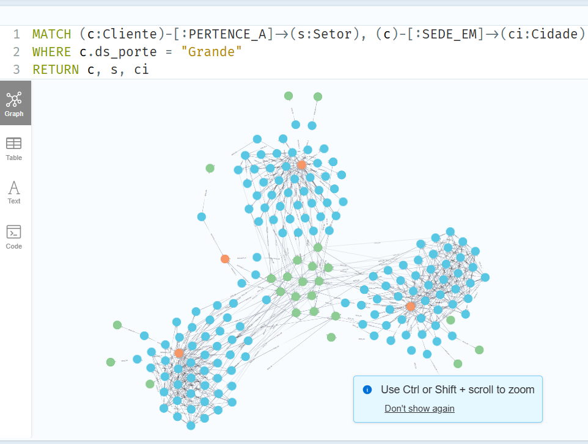
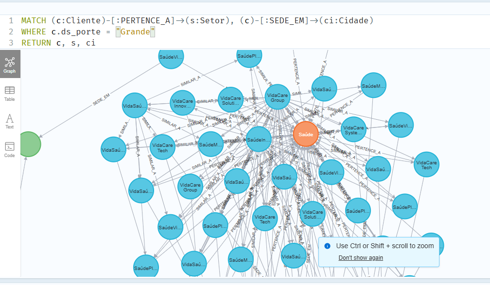
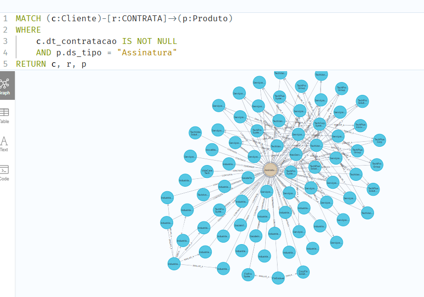
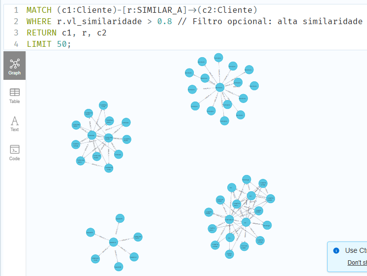

# Modelagem de Dados em Grafos para a startup VitalMind

**MBA em Business Intelligence – Turma 5BIR**
**Disciplina Graphs Analytics**

## VitalMind

A VitalMind é uma startup SaaS que desenvolve soluções para promover a saúde mental no ambiente corporativo. Seu modelo de negócio é baseado em três pilares principais:

1. **Plataforma SaaS de Monitoramento Preditivo**: Um software baseado em inteligência artificial que analisa dados de colaboradores (de forma anônima e ética) para prever riscos de saúde mental, como estresse ou burnout, permitindo intervenções proativas.
2. **Relatórios Personalizados e Benchmarking**: Relatórios detalhados sobre o bem-estar dos funcionários, com comparações setoriais, voltados para empresas que buscam insights estratégicos.
3. **Treinamentos e Eventos Exclusivos**: Programas de capacitação para líderes e equipes, focados em resiliência, gestão de estresse e cultura organizacional.

## Proposta de Modelagem em Grafos

Este trabalho propõe um modelo conceitual de banco de dados de grafo utilizando Neo4j para segmentação dos clientes da VitalMind. A modelagem considera os segmentos de empresas de médio e grande porte, distribuídas por setores econômicos e regiões geográficas, com o objetivo de suportar análises de mercado e personalização de serviços. O modelo inclui nós para Clientes, Setores, Produtos e Regiões, conectados por relacionamentos que representam interações e características.

## Planejamento

### Modelo Conceitual

| **Elemento** | **Tipo**       | **Descrição**                                    |
|--------------|----------------|--------------------------------------------------|
| Cliente      | Nó             | Representa uma empresa cliente da VitalMind      |
| Setor        | Nó             | Representa o setor de atuação da empresa         |
| Produto      | Nó             | Representa os produtos/serviços da VitalMind     |
| Cidade       | Nó             | Representa a localização geográfica do cliente   |
| PERTENCE_A   | Relacionamento | Indica o setor de atuação do cliente             |
| CONTRATA     | Relacionamento | Indica quais produtos o cliente contratou        |
| SEDE_EM      | Relacionamento | Indica a localização geográfica do cliente       |
| SIMILAR_A    | Relacionamento | Conecta clientes com características semelhantes |

### Entidades

#### Clientes

Os clientes-alvo da VitalMind são empresas de médio porte (50-250 funcionários) e grande porte (>250 funcionários), distribuídas em setores como Tecnologia, Finanças, Manufatura, Saúde, Varejo e Serviços. A startup opera inicialmente no Brasil, com foco em cidades de médio e grande porte, como São Paulo, Rio de Janeiro e Belo Horizonte, mas planeja expansão para a América Latina. Cada segmento apresenta necessidades específicas:

- **Empresas de Médio Porte**: Priorizam soluções acessíveis e escaláveis.
- **Empresas de Grande Porte**: Demandam integração com sistemas existentes, relatórios avançados e conformidade regulatória.
- **Setores**: Tecnologia valoriza inovação e integração; Finanças e Saúde requerem conformidade; Manufatura busca produtividade.

Propriedades:

| **Nome** | **Tipo** | **Descrição** |
| --- | --- | --- |
| id_cliente | string | Identificador único do cliente |
| nm_fantasia | string | Nome da empresa |
| qt_funcionarios | int | Quantidade de funcionários |
| ds_porte | string | "Médio" ou "Grande" |
| id_cidade_sede | string | Código da cidade |
| dt_contratacao | date | Data de contratação |

#### Setores

Propriedades:

| **Nome** | **Tipo** | **Descrição** |
| --- | --- | --- |
| id_setor | string | Identificador único do setor |
| nm_setor | string | Nome do setor |
| ds_regulamentacao | string | Complexidade de regulamentação do setor (“Alta”, “Média”, “Baixa”) |

#### Produtos

Propriedades:

| **Nome** | **Tipo** | **Descrição** |
| --- | --- | --- |
| id_produto | string | Identificador único do produto |
| nm_produto | string | Nome do produto |
| ds_tipo | string | "Assinatura", "Relatório", "Treinamento" |
| vl_preco_base | float | Preço base ou unitário |

#### Cidades

Propriedades:

| **Nome** | **Tipo** | **Descrição** |
| --- | --- | --- |
| id_cidade | string | Identificador único da cidade |
| nm_cidade | string | Nome da cidade |
| nm_estado | string | Nome do estado |
| nm_pais | string | Nome do país |
| ds_regiao_estrategia | string | Descrição de campo para estratégia de vendas “LATAM”, “SP”, etc. |

### Relacionamentos

- (Cliente)-[:PERTENCE_A]->(Setor)
- (Cliente)-[:CONTRATA {dt_inicio, ds_frequencia, vl_contrato}]->(Produto)
- (Cliente)-[:SEDE_EM]->(Cidade)
- (Cidade)-[:LOCALIZADA_EM]->(Cidade)
- (Cliente)-[:SIMILAR_A {vl_similaridade}]->(Cliente)

## Execução e implementação

### Criação de projeto

Para a implementação do modelo, foi criado um projeto do tipo “Blank Sandbox – Graph Data Science” na _sandbox_ do neo4j.

### Importação dos dados

Para importação dos dados, foi utilizado o **neo4j Data Importer**.



### Criação dos relacionamentos restantes

Para a criação dos demais relacionamentos, foi utilizado o terminal via browser. Seguem comandos _cypher_.

```cql
// 1. Create PAIS_Brasil Node and State-to-Country LOCALIZADA_EM Relationships
MERGE (p:Cidade {id_cidade: 'PAIS_Brasil', nm_cidade: 'Brasil', nm_estado: '', nm_pais: 'Brasil', ds_regiao_estrategia: 'LATAM'})
WITH p
MATCH (e:Cidade)
WHERE e.id_cidade STARTS WITH 'EST_'
MERGE (e)-[:LOCALIZADA_EM]->(p);

// 2. Create CONTRATA Relationships
// P1: Assinatura Plataforma (100% of clients with non-null dt_contratacao)
MATCH (c:Cliente)
WHERE c.dt_contratacao IS NOT NULL
MATCH (p1:Produto {id_produto: "P1"})
MERGE (c)-[:CONTRATA {dt_inicio: c.dt_contratacao, ds_frequencia: "Mensal", vl_contrato: 2000.0}]->(p1);

// P2: Relatórios Personalizados (20% of clients with non-null dt_contratacao)
MATCH (c:Cliente)
WHERE c.dt_contratacao IS NOT NULL
WITH c, rand() AS r
WHERE r < 0.2
MATCH (p2:Produto {id_produto: "P2"})
MERGE (c)-[:CONTRATA {dt_inicio: c.dt_contratacao, ds_frequencia: "Trimestral", vl_contrato: 5000.0}]->(p2);

// P3: Treinamentos e Eventos (10% of clients with non-null dt_contratacao)
MATCH (c:Cliente)
WHERE c.dt_contratacao IS NOT NULL
WITH c, rand() AS r
WHERE r < 0.1
MATCH (p3:Produto {id_produto: "P3"})
MERGE (c)-[:CONTRATA {dt_inicio: c.dt_contratacao, ds_frequencia: "Semestral", vl_contrato: 10000.0}]->(p3);

// 3. Create SIMILAR_A Relationships (10% of pairs, same sector and size)
MATCH (c1:Cliente)
MATCH (c2:Cliente)
WHERE c1.id_cliente < c2.id_cliente // Avoid duplicates
AND c1.ds_porte = c2.ds_porte
AND EXISTS {
    MATCH (c1)-[:PERTENCE_A]->(s:Setor)
    MATCH (c2)-[:PERTENCE_A]->(s2:Setor)
    WHERE s.id_setor = s2.id_setor
}
AND rand() < 0.1 // 10% chance
MERGE (c1)-[:SIMILAR_A {vl_similaridade: 0.6 + rand() * 0.3}]->(c2);
```

## Análise

### Validação das inclusões de dados

Para testar se os dados foram corretamente inseridos, foram testados os comandos abaixo:

```cql
// Node counts
MATCH (c:Cliente) RETURN COUNT(c); // 300
MATCH (ci:Cidade) RETURN COUNT(ci); // ~50 (28 cities + states + PAIS_Brasil)
MATCH (s:Setor) RETURN COUNT(s); // 6
MATCH (p:Produto) RETURN COUNT(p); // 3

// Relationship counts
MATCH ()-[:PERTENCE_A]->() RETURN COUNT(*); // 300
MATCH ()-[:SEDE_EM]->() RETURN COUNT(*); // 300
MATCH ()-[:CONTRATA]->() RETURN COUNT(*); // ~117 (90 P1 + ~18 P2 + ~9 P3)
MATCH ()-[:SIMILAR_A]->() RETURN COUNT(*); // ~900 (varies with rand())
MATCH ()-[:LOCALIZADA_EM]->() RETURN COUNT(*); // ~50 (28 city-to-state + state-to-country)

// Sample visualization
MATCH (c:Cliente)-[:PERTENCE_A]->(s:Setor), (c)-[:SEDE_EM]->(ci:Cidade)
WHERE c.id_cliente IN ["C001", "C002", "C003"]
RETURN c, s, ci;
```

### Visualização do modelo



## Resultados e Conclusões

Bancos de dados de grafo, como o Neo4j, são particularmente adequados para modelar relações complexas entre entidades, como clientes, produtos e localizações geográficas. Além disso, traz ganhos práticos e eficientes como a visualização das relações, comunidades, similaridade etc.

**Clientes potenciais por cidade:**





**Grandes clientes potenciais por setor:**





**Clientes que contrataram produto de _Assinatura_:**



**Similaridade entre clientes:**



Por fim, conclui-se que a utilização do banco de dados de grafos Neo4j para modelar e analisar relações entre clientes, cidades, setores e produtos da Vitalmind, demonstrou benefícios significativos para a inteligência de negócios, revelando padrões complexos de forma eficiente e visualmente acessível com o Neo4j Bloom. A estrutura flexível do grafo, aliada à integração robusta de dados via Data Importer e consultas Cypher, permitiu insights estratégicos, como segmentação de clientes por similaridade e otimização de portfólio de produtos, fortalecendo a tomada de decisão e pavimentando o caminho para análises preditivas e personalização em larga escala.
